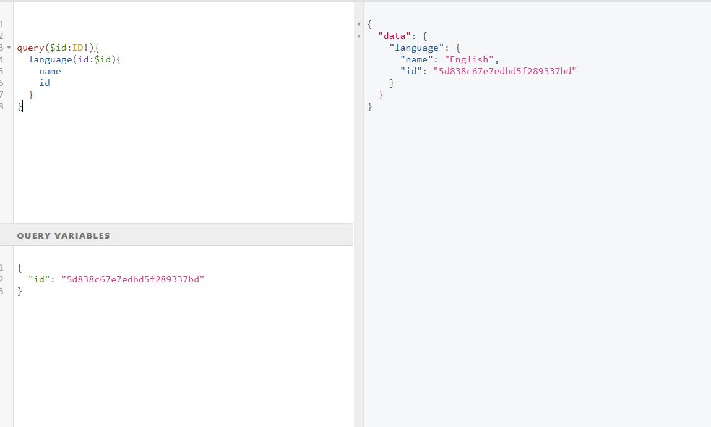

# Getting Started

###Graph-QL starter
This project is first step into graph ql and has details on how to use mutation and query for graph ql

```Query```

These are read only and query objects on the application

######
query {
  vehicles(count: 1) 
  {
    id, 
    type, 
    modelCode
}
}


```Mutation```

Provides crud details

######

* Vehicle Object Creation

mutation {
  createVehicle(type: "car", modelCode: "XYZ0192", brandName: "XYZ", launchDate: "2016-08-16") 
  {
    id
  }
}
 * Complex Mutation Object
 
  mutation{
    addPost(title:"Cest e Lavie",likes:35,comments:"good article",lang:{id:"5d860d3f0188043ea06e0ddd",name:"French"}) {
      id
    }
    
  }

* Caching the Queries
   
   